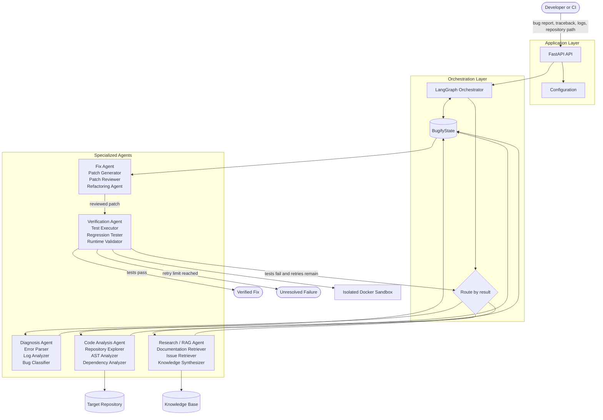
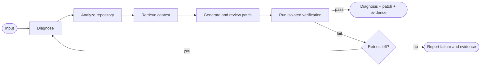
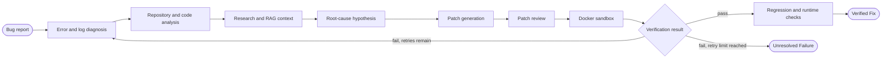
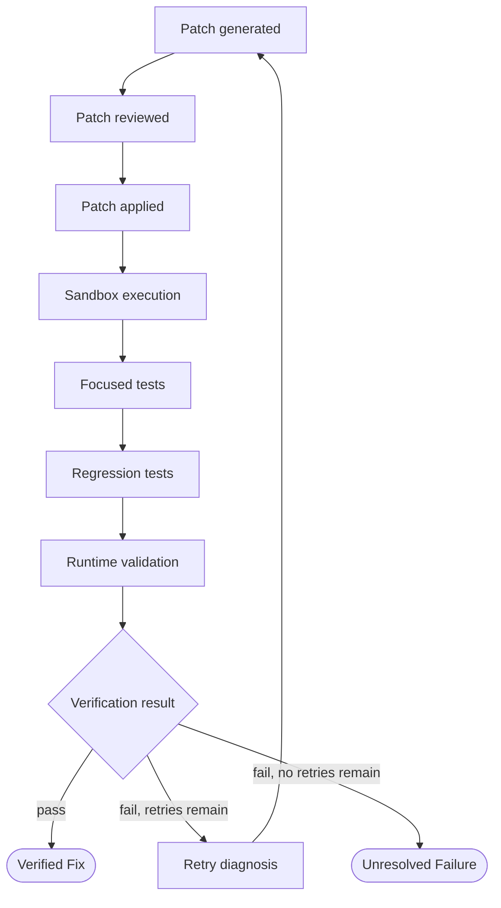
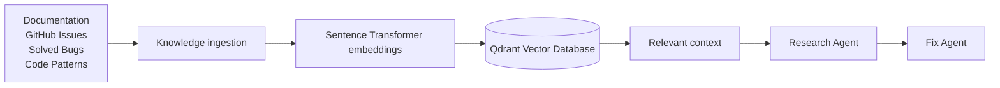

🐞 Bugify

Autonomous Multi-Agent AI Debugging System

Bugify is an autonomous multi-agent AI debugging system that analyzes bug reports, tracebacks, logs, and source repositories to identify root causes, generate reviewed patches, and verify fixes through automated testing.

🧠 What is Bugify?

Debugging a software project usually requires several separate activities:

Understanding the error and traceback

Finding the files responsible for the failure

Inspecting code and dependencies

Searching documentation and known issues

Identifying the root cause

Generating a minimal patch

Reviewing the patch

Running tests and regression checks

Iterating when the proposed fix fails

Bugify combines these activities into one agentic debugging workflow.

The system uses specialized AI agents coordinated through LangGraph, while a shared state keeps the complete debugging investigation consistent from diagnosis to verification.

## Architecture

Bugify separates workflow control, specialized reasoning, repository access, knowledge retrieval, and isolated verification. The orchestrator passes a shared `BugifyState` through each stage so every agent can build on the same evidence.

### Runtime Architecture



### Infrastructure and Integrations

```mermaid
flowchart LR
    subgraph BUGIFY[Bugify Runtime]
        api[FastAPI] --> graph[LangGraph] --> agents[Agent modules] --> tools[File, Git, shell, and test tools]
    end

    llm[Groq, OpenAI, or Anthropic] --> agents
    embeddings[Sentence Transformers] --> rag[RAG Retriever]
    qdrant[(Qdrant Vector Database)] <--> rag
    rag --> agents
    git[GitPython] --> tools
    parser[Tree-sitter and AST tooling] --> tools
    docker[Docker] --> sandbox[Sandbox Executor]
    sandbox --> tools
    pytest[Pytest] --> sandbox
    langsmith[LangSmith] -. tracing .-> graph
```
### Workflow Outcomes


## Multi-Agent System

Bugify contains five primary agents, each responsible for a distinct stage of the debugging lifecycle.

1. Diagnosis Agent

Determines what is failing and how the failure should be classified.

Sub-agents:

Error Parser — extracts exception type, message, file, line, and function.

Log Analyzer — detects errors, warnings, and recurring failure patterns.

Bug Classifier — classifies the bug type, severity, and confidence.

Output:

Bug Type
Severity
Confidence
Error Information
Relevant Files
Log Patterns

2. Code Analysis Agent

Builds an understanding of the target repository and the code surrounding the failure.

Sub-agents:

Repository Explorer — maps project structure and identifies relevant files.

AST Analyzer — analyzes source structure and code relationships.

Dependency Analyzer — identifies imports, packages, and dependency relationships.

Output:

Project Structure
Relevant Source Files
Test Files
Entry Points
AST Information
Dependency Relationships

3. Research / RAG Agent

Provides external and internal technical context relevant to the failure.

Sub-agents:

Documentation Retriever

Issue Retriever

Knowledge Synthesizer

Knowledge sources can include:

Documentation
Known Issues
Solved Bugs
Code Patterns
Technical Knowledge

The retrieved information is stored as contextual evidence for downstream agents.

4. Fix Agent

Uses the diagnosis, code analysis, and retrieved context to construct a targeted solution.

Sub-agents:

Patch Generator — generates a candidate patch.

Patch Reviewer — checks correctness and scope.

Refactoring Agent — performs optional cleanup when appropriate.

The objective is to produce a minimal, targeted change rather than unnecessarily modifying unrelated code.

5. Verification Agent

Determines whether the generated patch actually resolves the problem.

Sub-agents:

Test Executor

Regression Tester

Runtime Validator

Verification is performed in an isolated execution environment when required.

## End-to-End Workflow


## Shared State

All workflow stages communicate through a shared BugifyState.

class BugifyState(TypedDict):

    # User input
    problem: str
    traceback: str
    repository_path: str

    # Diagnosis
    bug_type: Optional[str]
    relevant_files: List[str]

    # Root cause
    hypotheses: List[str]
    root_cause: Optional[str]

    # Research
    retrieved_context: List[str]

    # Fix
    proposed_patches: List[str]

    # Verification
    test_output: Optional[str]
    tests_passed: bool

    # Workflow control
    iteration: int

    # Final response
    final_answer: Optional[str]

The state provides a common contract between agents and allows the orchestrator to preserve information across multiple debugging iterations.

## Verification Loop

A generated patch is not considered a successful fix simply because an LLM produced it. Bugify uses a verification gate before reporting success.



This creates a clear distinction between an AI-generated patch and a verified software fix.

## RAG Pipeline

Bugify uses Retrieval-Augmented Generation to provide relevant technical knowledge to the research and fixing stages.


🛠️ Technology Stack

Layer

Technology

Language

Python 3.10+

LLM

Groq

Agent Orchestration

LangGraph

LLM Framework

LangChain

Embeddings

Sentence Transformers

Vector Database

Qdrant Cloud

Code Parsing

Tree-sitter / Python AST / Astroid

Repository Operations

GitPython

Execution Isolation

Docker

Testing

Pytest

API

FastAPI

Server

Uvicorn

Observability

LangSmith

Configuration

Python-dotenv

## Project Structure

```text
Bugify/
├── app/
│   ├── __init__.py
│   ├── config.py
│   └── main.py
├── agents/
│   ├── __init__.py
│   ├── diagnosis/
│   │   ├── __init__.py
│   │   ├── agent.py
│   │   └── subagents/
│   │       ├── __init__.py
│   │       ├── bug_classifier.py
│   │       ├── error_parser.py
│   │       └── log_analyzer.py
│   ├── code_analysis/
│   │   ├── __init__.py
│   │   ├── agent.py
│   │   └── subagents/
│   │       ├── __init__.py
│   │       ├── ast_analyzer.py
│   │       ├── dependency_analyzer.py
│   │       └── repository_explorer.py
│   ├── fix/
│   │   ├── __init__.py
│   │   ├── agent.py
│   │   └── subagents/
│   │       ├── __init__.py
│   │       ├── patch_generator.py
│   │       ├── patch_reviewer.py
│   │       └── refactoring_agent.py
│   ├── research/
│   │   ├── __init__.py
│   │   ├── agent.py
│   │   └── subagents/
│   │       ├── __init__.py
│   │       ├── documentation_retriever.py
│   │       ├── issue_retriever.py
│   │       └── knowledge_synthesizer.py
│   └── verification/
│       ├── __init__.py
│       ├── agent.py
│       └── subagents/
│           ├── __init__.py
│           ├── regression_tester.py
│           ├── runtime_validator.py
│           └── test_executor.py
├── code_analysis/
│   ├── __init__.py
│   ├── dependency.py
│   ├── file_utils.py
│   ├── parser.py
│   └── repository.py
├── knowledge/
│   ├── code_patterns/
│   ├── documents/
│   ├── github_issues/
│   └── solved_bugs/
├── llm/
│   ├── __init__.py
│   ├── groq_client.py
│   ├── model_registry.py
│   └── prompts.py
├── orchestrator/
│   ├── __init__.py
│   ├── graph.py
│   ├── nodes.py
│   ├── router.py
│   └── state.py
├── prompts/
│   ├── code_analysis/
│   ├── diagnosis/
│   ├── fix/
│   ├── research/
│   └── verification/
├── rag/
│   ├── __init__.py
│   ├── collections.py
│   ├── embeddings.py
│   ├── ingestion.py
│   ├── qdrant_client.py
│   └── retriever.py
├── sandbox/
│   ├── __init__.py
│   ├── docker_manager.py
│   ├── executor.py
│   ├── security.py
│   └── test_runner.py
├── schemas/
│   ├── __init__.py
│   ├── agent.py
│   ├── bug.py
│   ├── patch.py
│   └── test.py
├── scripts/
│   ├── create_collection.py
│   ├── ingest_knowledge.py
│   └── run_bugify.py
├── tests/
│   ├── agent_tests/
│   ├── benchmark/
│   ├── integration/
│   └── unit/
├── tools/
│   ├── __init__.py
│   ├── file_tools.py
│   ├── git_tools.py
│   ├── shell_tools.py
│   └── test_tools.py
├── .env
├── .gitignore
├── readme.md
└── requirements.txt
```

Recommended repository additions:

- `.env.example` for documenting required environment variable names without secrets.
- `LICENSE` to make the project's usage and redistribution terms explicit.
- Rename `readme.md` to `README.md` if you want GitHub's conventional casing.
⚙️ Installation

Prerequisites

Python 3.10+

Docker Desktop

Groq API key

Qdrant Cloud configuration

LangSmith API key for observability

1. Clone

git clone <repository-url>
cd Bugify

2. Create Virtual Environment

python -m venv .venv

3. Activate

.\.venv\Scripts\Activate.ps1

4. Install Dependencies

python -m pip install --upgrade pip
python -m pip install -r requirements.txt

🔐 Environment Configuration

Create .env:

GROQ_API_KEY=your_groq_api_key

QDRANT_URL=your_qdrant_url
QDRANT_API_KEY=your_qdrant_api_key

LANGCHAIN_TRACING_V2=true
LANGCHAIN_API_KEY=your_langsmith_api_key
LANGCHAIN_PROJECT=Bugify
LANGCHAIN_ENDPOINT=https://api.smith.langchain.com

Optional integrations:

TAVILY_API_KEY=your_tavily_api_key
GITHUB_TOKEN=your_github_token

Never commit .env to source control.

🧪 Testing

Run the complete test suite:

python -m pytest -q

Run tests with verbose output:

python -m pytest -v

Run a specific unit test:

python -m pytest tests/unit/test_error_parser.py -v

Run the Diagnosis Agent test:

python -m pytest tests/unit/test_diagnosis_agent.py -v

🔒 Security Model

Bugify may execute generated code, therefore generated patches should not be executed directly on the host system.

The sandbox layer is responsible for enforcing:

Repository boundaries

Process isolation

Execution timeouts

Resource limits

Filesystem restrictions

Network restrictions where required

Safe test execution

Primary security components:

sandbox/
├── docker_manager.py
├── executor.py
└── security.py

🧪 Testing Strategy

Layer

Purpose

Unit

Test individual components in isolation

Integration

Validate communication between agents

Agent Tests

Validate LLM-backed agent behavior

Regression

Ensure the original bug remains fixed

Benchmark

Evaluate debugging performance across known bugs

The original failing case should be preserved as a regression test whenever practical.

📊 Observability

Bugify is designed to support LangSmith for tracing and debugging the agent workflow.

Observability can be used to inspect:

Agent execution

LLM calls

Prompts and responses

Retrieval steps

Workflow transitions

Iteration behavior

Latency

Debugging failures

🚧 Development Status

✅ Completed

Initial project architecture

Shared BugifyState

LLM client structure

Diagnosis Agent

Error Parser

Log Analyzer

Bug Classifier

Diagnosis Agent unit tests

🔨 In Progress

Repository Explorer

AST Analyzer

Dependency Analyzer

Code Analysis Agent

📌 Planned

Research / RAG Agent

Qdrant ingestion pipeline

Documentation Retriever

Issue Retriever

Knowledge Synthesizer

Fix Agent

Patch Generator

Patch Reviewer

Verification Agent

Docker sandbox

LangGraph orchestration

Retry routing

FastAPI interface

End-to-end testing

Benchmark evaluation

🗺️ Roadmap

Foundation
    │
    ▼
Diagnosis Agent
    │
    ▼
Code Analysis Agent
    │
    ▼
Research / RAG Agent
    │
    ▼
Fix Agent
    │
    ▼
Verification Agent
    │
    ▼
LangGraph Orchestration
    │
    ▼
Docker Sandbox
    │
    ▼
FastAPI Interface
    │
    ▼
End-to-End Evaluation

🎯 Design Principles

Bugify follows a few core engineering principles:

1. Modular Agents

Each agent has a clearly defined responsibility.

2. Shared State

Agents communicate through a structured state contract rather than loosely passing information.

3. Deterministic Tools

Repository exploration, parsing, testing, and other tooling should remain independently testable without requiring an LLM.

4. Minimal Patches

The Fix Agent should prefer targeted changes over unnecessary refactoring.

5. Verification Before Completion

A generated patch should only be reported as successful after appropriate testing and validation.

6. Iterative Debugging

A failed verification should provide evidence for another debugging iteration rather than immediately ending the workflow.

🔮 Future Extensions

Potential future capabilities include:

GitHub repository integration

Automatic GitHub Issue analysis

Pull Request generation

Code diff visualization

Human approval checkpoints

Multiple LLM provider support

Persistent LangGraph checkpoints

Advanced dependency graphs

Cost and latency tracking

Agent-level evaluation

Bug-fix benchmark datasets

🤝 Contributing

When contributing to Bugify:

Keep changes focused on one workflow stage.

Add or update the relevant tests.

Preserve the shared BugifyState contract.

Keep deterministic tools independent from LLM calls where possible.

Avoid committing credentials or secrets.

Document significant architectural changes.

📄 License

No license has been selected for this project yet.

🐞 Bugify

Autonomous Multi-Agent AI Debugging System
Python · LangGraph · LangChain · Groq · Qdrant · Docker · FastAPI · Pytest · LangSmith


